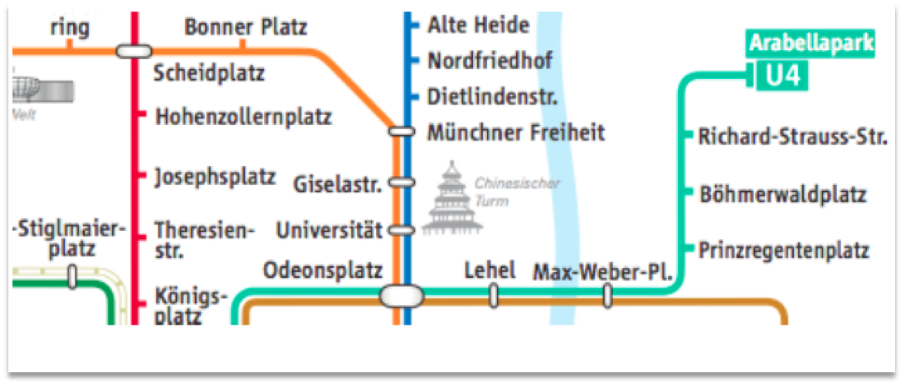
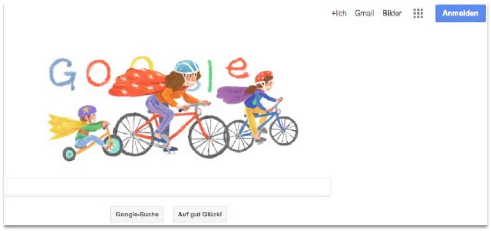

# Interactive Systems: Übung 1

**Ausgabe**: 07. Mai 2020  
**Abgabe**: 13. Mai 2020 23:59 Uhr  

**Erreichte Punktzahl**: 	Theorie: **[8/10]**, 	Projekt: **[10/10]**, 	gesamt: **[18/20]**

## Theoretischer Teil: Gestaltgesetze  *[10 Punkte]*

In der Übung haben Sie sechs Gestaltgesetze kennengelernt: 

Geschlossenheit, Nähe, Ähnlichkeit, Einfachheit, Fortsetzung und Verbundenheit. 

Im Folgenden finden Sie mehrere Beispiele von Benutzeroberflächen und grafischen Elementen. Geben Sie für jedes Beispiel an, welche dieser sechs Gestaltgesetze dort Anwendung finden und welche Wirkung dadurch erzielt wird. Begründen Sie Ihre Aussagen.

#### a) Mac OS X Dateibrowser *[2 Punkte]*

------

Gesetz der Nähe. Klickt man auf einen Ordner werden alle Unterordner und/oder Dateien untereinander in einer Spalte aufgelistet. Dadurch bekommt man das Gefühl von Ordnung und dass alle Ordner und/oder Dateien in dieser Spalte zusammengehören.
Dadurch, dass die Spalten relativ weit entfernt sind, werden diese als getrennt empfunden. Die untereinander stehende Ordner als zueinander gehörig empfunden, da sie nahe beieinander platziert sind. **[richtig]**

Gesetz der Ähnlichkeit wegen den Icons. Jedes dieser Ordner-Icons hat die gleiche Form. Eine Datei zB. hätte ein anderes Icon. Dadurch bekommt das Gefühl von Übersichtlichkeit, weil man auf einem Blick sieht, was ein Ordner ist und was etwas anderes ist. **[richtig]**

Gesetz der Geschlossenheit. Alle Dateien und Ordner in einer Spalten werden als zueinander gehörig empfunden, da diese durch eine feine graue Linie getrennt sind. Der Grund ist, dass geschlossene Formen als eigenständige Objekte wahregenommen werden und die Objekte darin als zueinander gehörig gruppiert **[richtig]**

**[2/2]**

------

#### b) Ausschnitt aus Google Kalender *[2 Punkte]*

------

Gesetz der Ähnlichkeit. Man sieht Kalendereinträge die verschiedenfarbig hinterlegt sind. Durch unterschiedliche Farben bekommt man das Gefühl der Zugehörigkeit von Objekten, die die gleichen Farben besitzen. 

In diesem Beispiel sieht man zwei Einträge mit der Farbe blau, was einem vermittelt, dass diese der gleichen Kategorie angehörig sind.

Der Grund ist, das Objekte die gleiche Eigenschaften haben, vom Menschen als zugehörig angesehen werden und Objekte die unterschiedlich sind als getrennt. **[richtig]**

**Hier finden noch einige andere Gestaltgesetze Anwendung. [1/2]**

------

#### c) Ausschnitt aus dem MVV-Schnellbahnnetz *[2 Punkte]*

------

Gesetz der guten Fortsetzung. Bewirkt, dass trotz der Überschneidungen der Linien, diese als eine gesehen werden. Der Grund ist, dass diese als zusammengehörig war genommen werden, weil die Linie kontinuierlich erscheint. **[richtig]**

Gesetz der Ähnlichkeit. Jede Linie hat eine eigene Farbe, was sie als getrennt erscheinen lässt. Dadurch wird dem Menschen vermittelt, dass jede Linie ein eigene Bahnlinie ist. Denn Objekte die nicht gleichartig sind, werden als verschiedenartig empfunden. **[richtig]**

Gesetz der Verbundentheit, was besagt, dass miteinander verbundene Formen als zusammengehörig wahregenommen werden. Die einzelnen Straßennamen werden als zugehörig angesehen durch die farbigen Linien, die sie verbinden. So weiß man, dass die Alte Heide und die Münchner Freiheit auf einer Bahnstrecke sind. **[richtig]**

**[2/2]**

------

#### d) Google Startseite *[2 Punkte]*

------

Gesetz der guten Fortsetzung. Es scheint so als würde das 'g' von Google in den Helm einfließen. Das Hirn sieht das als ein ganzes 'g', obwohl man eigentlich nur den unteren Teil lesen kann. Somit ist es kein Problem für den Nutzer das Wort 'Google' zu lesen. 

Der Grund ist, dass Objekte als zusammengehörig wahr genommen werden, wenn sie auf einer kontinuierlichen Linie liegen. **[richtig]**

**Hier finden noch einige andere Gestaltgesetze Anwendung. [1/2]**

------

#### e) News Aggregator Newsmap (https://newsmap-js.herokuapp.com) *[2 Punkte]*

------

Gesetz der Ähnlichkeit. Jede dieser Farben hat eine eigene Kategorie. Rot zB. World. Dadurch, dass jede dieser Zellen mit den entsprechenden Farben markiert ist, ist es leichter für den Nutzer auf eine Headline zuzugreifen. Denn Objekte die gleich aussehen, werden als zueinder gehörig empfunden. **[richtig]**

Auch spielt das Gesetz der Nähe hier eine Rolle, was besagt, dass Objekte die nah beieinander liegen als zueinander gehörig empfunden werden. Dadurch, dass zB. alle roten Felder nah beieinander liegen, ist es leichter für den User nach den Headlines der roten Kategorie zu suchen, als wenn alle Farben bunt vermischt wären. **[richtig]**

Gesetz der Einfachheit, besagt, dass man Formen immer so interpretiert, wie sie geometrisch am einfachsten sind. So sieht man hier in diesem Beispiel 7 Rechtecke, was es für den Nutzer leichter macht zu erkennen, welche News zu welchem Thema gehören, denn alle News zu einem Thema sind in einem Rechteck abgebildet. **[richtig]**

**[2/2]**

------

## Praktischer Teil: Formular zur Erhebung persönlicher Daten  *[10 Punkte]*

### Patterns

- **Structured Format**  
  https://proquest.tech.safaribooksonline.de/book/software-engineering-and-development/9781449379711/the-patterns/structured_format_html
-  **Input Prompt**  
  https://proquest.tech.safaribooksonline.de/book/software-engineering-and-development/9781449379711/the-patterns/input_prompt_html

### Aufgabenstellung

Erstellen Sie ein Formular, mit dem persönliche Daten erhoben werden können. Implementieren Sie die Pattern *Structured Format* und *Input Prompt* innerhalb dieses Formulars. Schauen Sie sich hierzu die Beispiele im Buch an und überlegen Sie, wie dies auf persönlichen Daten innerhalb des Formulars angewendet werden kann.

Dieses Formular muss mindestens enthalten:

- Vorname
- Nachname
- Straße
- Hausnummer
- Postleitzahl
- Stadt
- Land, per Dropdown Menü mit mindestens 3 Optionen
- E-Mail Adresse
- Geburtsdatum
- Interessen, per Freitext
- Geschlecht, per Radio Buttons
- Newsletter, per Checkbox

Am Ende des Formulars soll sich ein Sende-Button befinden. Bei einem Klick auf diesen sollen die Felder des Formulars (siehe oben) ausgelesen und angezeigt werden.

### Beispiel

Ein beispielhaftes Formular zur Datenerhebung:

### Anforderungen und Punkte

- Die geforderten Eingaben können getätigt werden. **[1/1 Punkt]**
- Die Eingabefelder haben entsprechende Labels (Beschriftungen). **[1/1 Punkt]**
- Das Pattern *Structured Format* wird an mindestens 2 Stellen angewendet. **[1/1 Punkt]**
- Das Pattern *Input Prompt* wird an mindestens 2 Stellen angewendet. **[1/1 Punkt]**
- Die getätigten Eingaben werden in der Ausgabe korrekt dargestellt. **[3/3 Punkte]**
- Die ausgegebenen Daten tragen korrekte Labels (Beschriftungen). **[3/3 Punkte]**

### Hinweise

- Sie können zur Bearbeitung der Aufgabe ein beliebiges Framework (z.B. Materialize) benutzen.
- Sie müssen nicht darauf achten, ob die Eingaben gültig sind. Allerdings sollten bei Zahlenfeldern nur Zahlen eingetragen werden können.
- Das Anzeigen der eingetragenen Daten kann an einem beliebigen Ort geschehen. Z.B. in einem neuen Fenster, im selben Fenster oder in einer überlagerten Box.
- Die angezeigten Daten sollten ein entsprechendes Label tragen.
- Ist ein Feld ausgefüllt, muss der Cursor nicht automatisch in das nächste Feld springen.
- Die getätigten Eingaben müssen nicht gespeichert werden. D.h. bei einem Reload der Seite findet man ein leeres Formular vor.
- Im Buch finden Sie Beispiele, wie die Patterns anzuwenden sind.

**Gesamtpunktzahl praktischer Teil: 10/10 Punkte. Gut gemacht!**