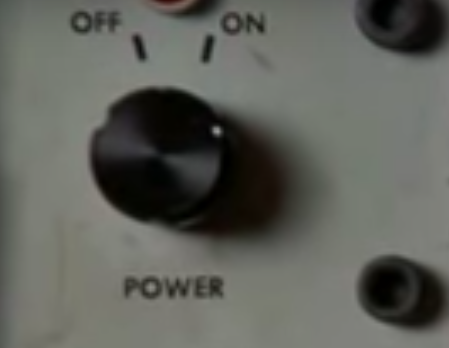
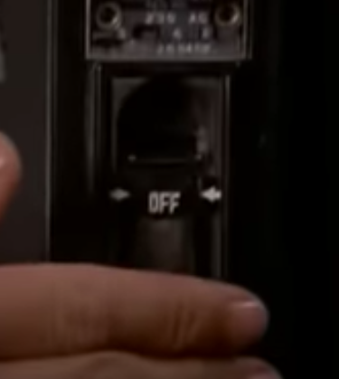
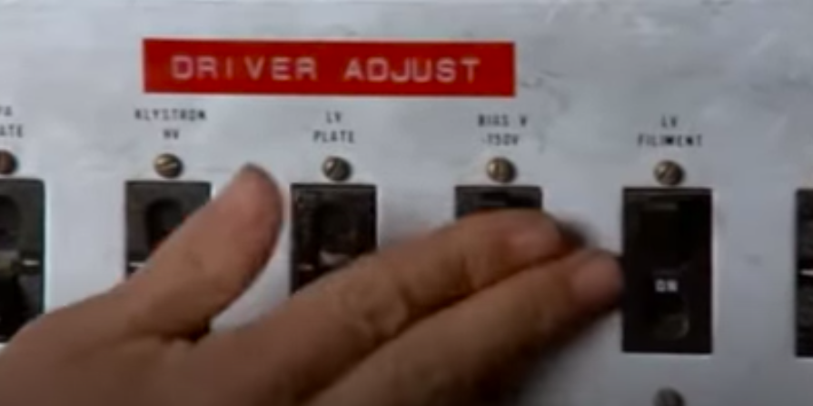
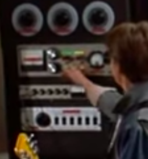
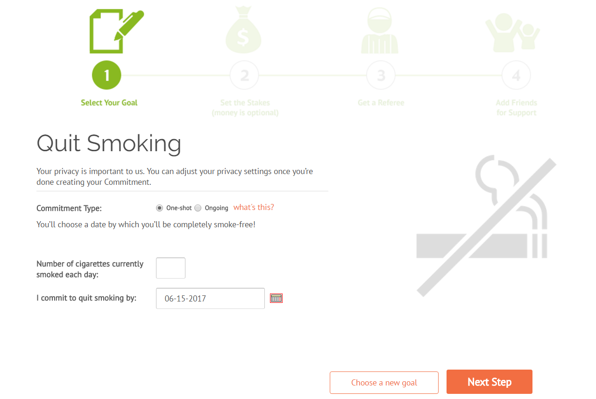

# Interactive Systems: Übung 4

**Ausgabe**: 4. Juni 2020  
**Abgabe**: 10. Juni 2020 23:59 Uhr  

**Erreichte Punktzahl**: 	Theorie: **[5,5/10]**, 	Projekt: **[10/10]**, 	gesamt: **[15,5/20]**

## Theoretischer Teil: Prinzipien der UI-Gestaltung  *[10 Punkte]*

In der Übung haben Sie fünf Prinzipien der Gestaltung von User Interfaces kennengelernt. 

Analysieren Sie das Video unter https://www.youtube.com/watch?v=m3v7U9EvoOo unter dem Aspekt dieser Prinzipien. Finden Sie für jedes Prinzip je zwei Beispiele **[1 Punkt pro Beispiel]**. Machen Sie hierfür jeweils Screenshots mit kurzer Beschreibung.  

------

**Affordance:**

Es ist nicht klar ob der Knopf gedreht, gedrückt oder gezogen werden kann

**[Ein Knopf hat immer erst mal die Affordance, dass man ihn drücken kann. Doch durch die Beschriftung "on/off" und den weißen Punkt in diesem Beispiel kann man leicht erkennen, dass man ihn drehen kann. 0/1 Punkt]**

Man kann das Rad in beide Richtungen drehen

**[richtig, 1/1 Punkte]**

**Constraints:** 

Hebel können nur nach oben oder unten bewegt werden und werden eingeschränkt durch die Bezeichnung
on and off.

Hebel können nur nach oben oder unten bewegt werden und werden eingeschränkt durch die Bezeichnung
on and off.

**[Nicht die Beschriftung, sondern die physische Beschaffenheit der Hebel sorgt für die Einschränkung. Bilder von zwei Beisielen von Hebeln, die aber gleich funktionieren, zählen nicht als zwei Beispiele. 0,5/2 Punkte]**

**Mappings:**

Alle Hebel die zu Driver Adjust gehören sind schön nebeneinander angeordnet auf einem weißen
Hintergrund.

Man sieht hier schön, wie jeder Hebel oder Schalter das zu einer Funktion gehört, nebeneinander liegen
und durch die unterschiedliche Hintergrundfarbe getrennt sind.

**[richtig, 2/2 Punkte]**

**Consistency:**

Alle diese Hebel werden nur für driver adjust verwendet, wodurch dies konsistent ist. Außerdem haben sie immer die gleiche Bedeutung, entwerder off and on.

Diese Hebel haben immer die gleiche Bedeutung, entweder off oder on, sowie auch im 1. Beispiel

**[Ein Hebel hat naturgemäß nur die beiden möglichen Zustände an oder aus, das hat noch nichts mit Konsistenz zu tun. Konsistenz in UI bezieht sich mehr darauf, wie die Elemente verwendet werden - zB dass Hebel immer so angeordnet sind, dass unten=aus ist. Bilder von zwei Beisielen von Hebeln, die aber gleich funktionieren, zählen nicht als zwei Beispiele. 0/2 Punkte]**

**Feedback:**

Hier leuchtet der Knopf grün, nachdem man etwas getan hat. Er gibt einen also Feedback.

Hier wandert der Zeiger nach rechts, nachdem man etwas getan hat, was einem Feedback gibt.

**[richtig, 2/2 Punkte]**

------

## Praktischer Teil: Pizza-Bestellvorgang Teil 1 *[10 Punkte]*

- In dieser Übung soll eine vereinfachte Variante zum Zusammenstellen und Bestellen einer Pizza erstellt werden. Die Übung ist in Teilaufgaben unterteilt und in dieser Übung soll eine **Vorlage für den Wizard** (Teilaufgabe a) erstellt werden, sowie **Schritt 1 des Bestellvorgangs** (Teilaufgabe b). 

  Im Folgenden wird kurz erläutert, wie der gesamte Bestellvorgang aussehen soll: Der Nutzer soll in der Lage sein, eine eigene Pizza zusammenzustellen und diese dann auch zu bestellen. Es soll insgesamt vier Schritte geben:

- Schritt 1: Hier soll der Nutzer die grundlegenden Eigenschaften der Pizza festlegen.

- Schritt 2: Hier soll der Nutzer den Belag seiner Pizza bestimmen können.

- Schritt 3: Hier soll der Nutzer eine Übersicht seiner bisherigen Auswahl einsehen können und seine Lieferadresse festlegen können.

- Schritt 4: Hier soll der Nutzer über den Erfolg des Vorgangs informiert werden.

Die zu bearbeitenden Teilaufgaben dieser Übung sind im Folgenden im Detail beschrieben.

### a) Vorlage für den Bestellvorgang *[5 Punkte]*

#### Patterns

- **Wizard**  
  https://proquest.tech.safaribooksonline.de/book/software-engineering-and-development/9781449379711/the-patterns/wizard_html
- **Sequence Map**  
  https://proquest.tech.safaribooksonline.de/book/software-engineering-and-development/9781449379711/the-patterns/sequence_map_html
- **Diagonal Balance**  
  https://proquest.tech.safaribooksonline.de/book/software-engineering-and-development/9781449379711/the-patterns/diagonal_balance_html

#### Aufgabenstellung

Ziel dieser Übung ist es, die Grundlage für den Bestellvorgang mit Hilfe des *Wizard Patterns* zu erstellen. 

Die einzelnen Schritte des Wizards werden durch die vier oben genannten Schritte definiert. Die Details jedes Schritts müssen in dieser Teilaufgabe noch nicht implementiert werden, der Nutzer soll aber in der Lage sein, sich durch einen quasi leeren Wizard mit vier Schritten hindurch zu klicken und mit Hilfe einer *Sequence Map* feststellen können, in welchem Schritt er sich aktuell befindet. Für jeden Schritt soll das Grundgerüst erstellt werden, welches Sie mithilfe des *Diagonal Balance* Patterns strukturieren sollen.

#### Beispiel

Auf https://www.stickk.com/ kann man *Commitments* eingehen um beispielsweise mit dem Rauchen aufzuhören. Zur Erstellung eines solchen wird ein Wizard genutzt. 

#### Anforderungen und Punkte

- Der Nutzer kann von Schritt 1 bis 4 mit Hilfe von Buttons vor und zurück navigieren. Ein Bild (bzw. Symbol) soll dabei darauf hinweisen, ob es vor oder zurück geht. **[2/2 Punkte]**

- Der Nutzer ist in der Lage, anhand einer *Sequence Map* festzustellen, in welchem Schritt er sich gerade befindet.  Jeder Punkt der Sequenz soll einen angemessen Namen und eine Nummer haben. **[2/2 Punkte]**

- Jeder einzelne Schritt soll mit dem *Diagonal Balance* Pattern strukturiert sein **[0,25/0,25 Punkte]** und jeweils folgende Elemente enthalten:
    - eine Überschrift, die den Schritt beschreibt **[0,25/0,25 Punkte]**
    - einen Platzhalterbereich, der später mit den spezifischen Schritt-Details gefüllt wird **[0,25/0,25 Punkte]**
    - Buttons zum Vor- und Zurücknavigieren **[0,25/0,25 Punkte]**

#### Hinweise

  - Schritt 1 benötigt keinen Zurück-Button.
  - Schritt 4 benötigt nur einen Button, welcher den Nutzer zurück zu Schritt 1 führen soll. Das Bild für den Button kann hier weggelassen werden.

### b) Bestellvorgang Schritt 1 - Pizza Basis *[10 Punkte]*

#### Patterns

- **Titled Sections**  
    https://proquest.tech.safaribooksonline.de/book/software-engineering-and-development/9781449379711/the-patterns/titled_sections_html
- **Chapter 8 - Control Choice (kein spezielles Pattern)**  
    https://proquest.tech.safaribooksonline.de/book/software-engineering-and-development/9781449379711/8dot-getting-input-from-users-forms-and-controls/control_choice_html

#### Aufgabenstellung

Ziel dieser Übung ist es, Schritt 1 des Wizards umzusetzen und somit den Platzhalter aus der vorigen Teilaufgabe a) für diesen Schritt zu ersetzen.

Der Nutzer soll auswählen können, welche Größe die Pizza haben soll, welches Mehl für den Teig verwendet werden soll und welche Soße er möchte. Zum Unterteilen der drei Eigenschaften soll das *Titled Sections* Pattern genutzt werden. Es ist Ihnen überlassen, das Auswählen der Optionen (Nutzereingabe) zu gestalten (siehe Kapitel 8 oben verlinkt für einige Möglichkeiten).

#### Anforderungen und Punkte

- Der Nutzer kann die Größe der Pizza wählen (Klein, Mittel, Groß). **[0,5/0,5 Punkte]**

- Der Nutzer kann den Teig (bzw. das Mehl) der Pizza wählen (Weizen oder Dinkel). **[0,5/0,5 Punkte]**

- Der Nutzer kann die Art der verwendeten Soße wählen (Basilikum, Knoblauch oder Scharf). **[0,5/0,5 Punkte]**

- Die drei Abschnitte der Kategorien (Größe, Teig, Soße) sollen mit dem *Titled Sections* Pattern unterteilt werden. **[1/1 Punkt]**

- Der Nutzer kann nur eine Option pro Kategorien wählen. **[0,5/0,5 Punkte]**

- Jede Auswahl-Option (z.B. Mittel) soll wie folgend gestaltet werden: **[2/2 Punkte]**
  - Man kann die Option auswählen (siehe Kapitel 8 - Control Choices).
  - Die Option hat ein angemessenes Label.
  - Die Kosten bzw. Zusatzkosten der Option werden angezeigt.

#### Hinweise

- Sie können die Preise frei wählen oder die folgenden verwenden:
  - Größe: Klein 2,50€, Mittel 3,50€, Groß 4,00€
  - Teig: Weizen kein Aufpreis, Dinkel +0,50€
  - Soße: Basilikum/ Knoblauch kein Aufpreis, Scharf +0,50€
